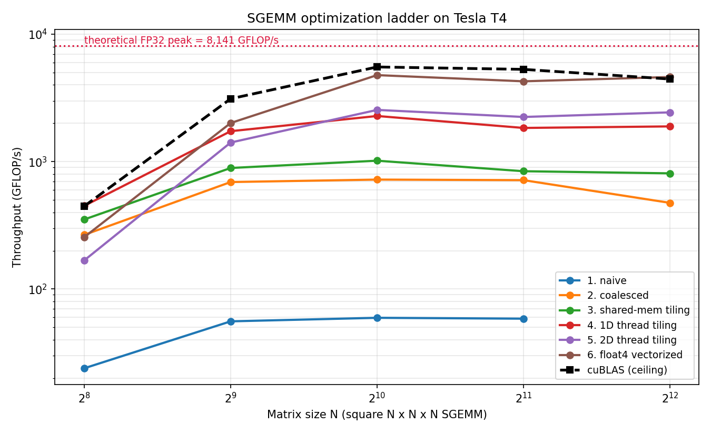
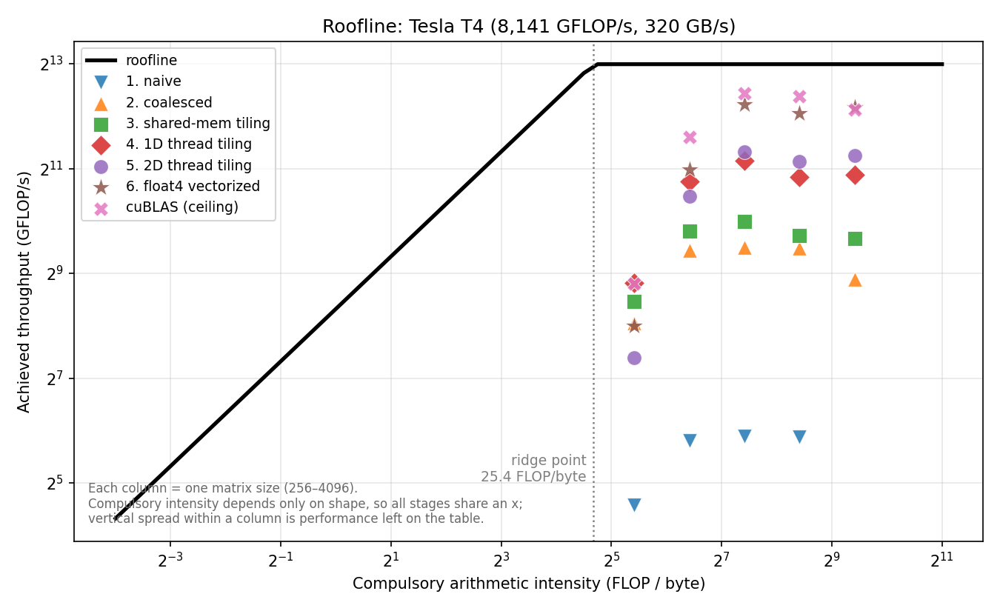

# Hand-optimized CUDA kernels for transformer inference

A six-stage SGEMM optimization ladder plus fused softmax/LayerNorm kernels,
written from scratch in CUDA C++, benchmarked against cuBLAS, and wired into a
real transformer's inference path through a PyTorch C++ extension.

**Target hardware:** NVIDIA Tesla T4 (Turing, `sm_75`).

**Headline:** the final kernel reaches **4,614 GFLOP/s at 4096³ — 103.7% of
cuBLAS**, i.e. it edges out NVIDIA's own library at that size, after Nsight
Compute drove a store-mapping fix worth 1.28×. Every stage is verified against a
float64 reference; 59 parity tests pass. All figures are generated from the
benchmark CSVs by `tools/make_results_md.py`; nothing is hand-entered.

The honest counterweight, stated up front: that win is **shape-specific**. At
512³ we reach only 64% of cuBLAS, and the end-to-end GPT-2 prefill is a **0.75×
regression** — because real transformer matmuls live in the small-to-medium
regime where cuBLAS's shape-specialized kernels dominate. See
[End-to-end](#part-3--pytorch-integration).

---

## The problem

Matrix multiply is the dominant cost in transformer inference, and a naive CUDA
implementation runs at a few percent of what the hardware can do. The gap is not
about arithmetic — the FLOP count is identical at every stage below. It is
entirely about **where data lives and how it moves**: DRAM → L2 → shared memory
→ registers, with roughly an order of magnitude in latency between each step.

This repo works through that gap in named, individually committed stages, so the
optimization story is visible in `git log` and each stage's benefit is
attributable to exactly one change.

## Why a T4 makes this comparison honest

On Ampere and newer, `cublasSgemm` may silently dispatch to **TF32 tensor
cores**. A hand-written FP32 SIMT kernel then gets compared against hardware it
is not allowed to use, and "% of cuBLAS" stops meaning anything. Turing has no
TF32 path, so `cublasSgemm` on a T4 runs the same class of instructions our
kernels run. The percentages in this README are apples-to-apples.

The constraints that shaped every design decision:

| Property | T4 (`sm_75`) | Why it matters here |
|---|---|---|
| SMs × FP32 cores | 40 × 64 | Sets the theoretical peak |
| **Threads per SM** | **1024** | Turing halved Volta's 2048. A 32×32 block *is* an entire SM — this is what forces register blocking in stages 4–6 |
| Shared memory per SM | 64 KB | Caps tile size |
| Registers per SM | 65536 | The real limit on `TM`×`TN`, and hence on arithmetic intensity |
| `cp.async` | **not available** | sm_80+ only; all shared-memory loads go the long way through registers |
| Roofline ridge point | ~25 FLOP/byte | Below this, a kernel is memory-bound no matter what |

---

## Part 1 — the SGEMM ladder

Each stage removes exactly one bottleneck. The header comment in each `.cu` file
explains the architectural reasoning in full; this is the summary.

| # | Stage | Bottleneck removed | Key idea |
|---|---|---|---|
| 1 | [Naive](kernels/01_sgemm_naive.cu) | — (baseline) | One thread per output element. `threadIdx.x` → row, so a warp's 32 lanes read addresses `K` floats apart: 32 separate memory sectors per load, 7/8 of every sector discarded |
| 2 | [Coalesced](kernels/02_sgemm_coalesced.cu) | Wasted DRAM transactions | `threadIdx.x` → **column** instead. Two lines changed. A warp now reads 32 contiguous floats (4 sectors) and broadcasts one value from `A`. ~33 → ~5 transactions per k-step |
| 3 | [Shared-mem tiling](kernels/03_sgemm_smem.cu) | DRAM traffic *volume* | Coalescing fixed *how* we fetch, not *how many*. Blocks cooperatively stage 32×32 tiles on-die, so each DRAM load is consumed 32× instead of once |
| 4 | [1D thread tiling](kernels/04_sgemm_blocktile_1d.cu) | Shared-memory bandwidth | Each thread owns an 8×1 strip in registers, so one `Bs` value feeds 8 FMAs. Smem loads per FMA: 2 → ~1.125 |
| 5 | [2D thread tiling](kernels/05_sgemm_blocktile_2d.cu) | Still shared-mem bound | Each thread owns an 8×8 square and forms a register **outer product**: 16 loads feed 64 FMAs. Smem loads per FMA → 0.25 |
| 6 | [float4 vectorized](kernels/06_sgemm_vectorized.cu) | Memory *instruction* count | 128-bit `LDG`/`LDS` replace four 32-bit accesses. `As` is stored transposed so each operand strip is contiguous and vectorizable |

The single idea running through stages 3–6: **push the working set down the
memory hierarchy so each level's bandwidth serves proportionally more
arithmetic.** Reuse in a 2D tile grows as O(T²) FMAs from O(T) loads, which is
why squares beat strips — and why the register file, not cleverness, sets the
ceiling on tile size.

### A prediction the sweep was designed to test — and the result

Stage 5 uses a 128×128 tile, so a 256×256 matmul produces a **2×2 grid — four
blocks on a 40-SM GPU**, leaving 36 SMs idle. I predicted stage 5 would *lose*
to stage 4 at the small end and only pull ahead once the grid fills the machine.

It did, and the crossover lands exactly where the arithmetic says it should:

| N | Stage 4 (64×64 tile) | Stage 5 (128×128 tile) | Stage 5 grid | Winner |
|---:|---:|---:|---|---|
| 256 | **544** GFLOP/s | 196 | 2×2 = 4 blocks / 40 SMs | Stage 4, by 2.8× |
| 512 | **1,835** | 1,436 | 4×4 = 16 blocks / 40 SMs | Stage 4, by 1.3× |
| 1024 | 2,101 | **2,507** | 8×8 = 64 blocks / 40 SMs | Stage 5 |
| 2048 | 2,042 | **2,748** | 16×16 = 256 blocks | Stage 5 |
| 4096 | 1,997 | **2,808** | 32×32 = 1024 blocks | Stage 5 |

The crossover is at N=1024 — the first size where stage 5's grid (64 blocks)
exceeds the GPU's 40 SMs. Below that, the "better" kernel loses because it
cannot fill the machine. **There is no best tile size, only a best tile size for
a shape**, and a single-size benchmark would have hidden this completely.

A second surprise in the same data: at N=256, stage 4 beats **cuBLAS** (544 vs
394 GFLOP/s, 138%). At that size cuBLAS's dispatch and heuristic overhead is a
meaningful fraction of a very short kernel.

### What the measurements showed

**1. The ladder works, and the biggest single win is the cheapest change.**
Stage 1 → 2 is a two-line row/column swap and buys **12.4× at N=256**. Nothing
later in the ladder comes close to that ratio of benefit to effort. Stage 6
reaches 87.7% of cuBLAS at 4096.

**2. The T4 throttles severely, and my first two attempts to measure around it
both failed.** SM clocks ranged from **585 to 1590 MHz** against a 1590 MHz
boost spec — a 2.7× spread. The first run timed stages in ladder order, so
cuBLAS was always measured last, when the card was hottest: at N=4096 it ran at
1005 MHz against our kernel's 1208, **flattering our "% of cuBLAS" by ~20%**.
Randomizing the order removed the systematic bias but not the variance — one
clock-normalized figure came back at **101.6% of peak**, which is impossible and
proved the coarse start/end clock sampling was not trustworthy either.

The fix that actually works is **interleaving**: every kernel is timed one
iteration at a time, round-robin, so all of them experience the same thermal
trajectory rather than a different slice of it. Absolute clocks still drift, but
relative comparisons — the entire point of a ladder — become valid. For
reference, here is the biased first run:

| N=4096 | GFLOP/s | SM clock | % of boost peak | % of peak *at that clock* |
|---|---:|---:|---:|---:|
| Stage 6 (ours) | 3,851 | 1,208 MHz | 47.3% | **62.3%** |
| cuBLAS | 4,390 | 1,005 MHz | 53.9% | **85.3%** |

So the honest gap is larger than the raw 87.7% suggests: cuBLAS is at 85% of
what the silicon could do at its clock, we are at 62%. `bench/bench_gemm.py` now
randomizes measurement order and inserts a cooldown between kernels, and reports
both percentages.

**3. No register spills anywhere.** Every kernel reports `lmem = 0`, confirming
the `float4` casts in stage 6 stayed in registers rather than silently falling
back to local memory — the failure mode that would have made the vectorization
pointless.

### Results

<!-- RESULTS:GEMM -->

#### 256 x 256 x 256

| Stage | GFLOP/s | % of FP32 peak | Speedup vs naive | % of cuBLAS | Max abs err | ms (mean ± sd) |
|---|---:|---:|---:|---:|---:|---:|
| 1. Naive | 23.9 | 0.3% | 1.0x | 5.3% | 4.20e-05 | 1.405 ± 0.392 |
| 2. Coalesced | 266.2 | 3.3% | 11.1x | 59.5% | 4.20e-05 | 0.126 ± 0.029 |
| 3. Shared-mem tiling | 351.6 | 4.3% | 14.7x | 78.6% | 4.20e-05 | 0.095 ± 0.022 |
| 4. 1D thread tiling | 450.0 | 5.5% | 18.8x | 100.6% | 4.20e-05 | 0.075 ± 0.016 |
| 5. 2D thread tiling | 167.9 | 2.1% | 7.0x | 37.6% | 4.20e-05 | 0.200 ± 0.052 |
| 6. float4 vectorized | 255.5 | 3.1% | 10.7x | 57.1% | 4.20e-05 | 0.131 ± 0.032 |
| cuBLAS | 447.2 | 5.5% | 18.7x | 100.0% | 4.20e-05 | 0.075 ± 0.013 |

#### 512 x 512 x 512

| Stage | GFLOP/s | % of FP32 peak | Speedup vs naive | % of cuBLAS | Max abs err | ms (mean ± sd) |
|---|---:|---:|---:|---:|---:|---:|
| 1. Naive | 55.8 | 0.7% | 1.0x | 1.8% | 0.00e+00 | 4.813 ± 0.200 |
| 2. Coalesced | 691.4 | 8.5% | 12.4x | 22.2% | 0.00e+00 | 0.388 ± 0.016 |
| 3. Shared-mem tiling | 891.3 | 10.9% | 16.0x | 28.6% | 0.00e+00 | 0.301 ± 0.126 |
| 4. 1D thread tiling | 1733.3 | 21.3% | 31.1x | 55.6% | 0.00e+00 | 0.155 ± 0.009 |
| 5. 2D thread tiling | 1411.9 | 17.3% | 25.3x | 45.3% | 0.00e+00 | 0.190 ± 0.009 |
| 6. float4 vectorized | 2009.7 | 24.7% | 36.0x | 64.5% | 0.00e+00 | 0.134 ± 0.008 |
| cuBLAS | 3115.2 | 38.3% | 55.9x | 100.0% | 0.00e+00 | 0.086 ± 0.010 |

#### 1024 x 1024 x 1024

| Stage | GFLOP/s | % of FP32 peak | Speedup vs naive | % of cuBLAS | Max abs err | ms (mean ± sd) |
|---|---:|---:|---:|---:|---:|---:|
| 1. Naive | 59.4 | 0.7% | 1.0x | 1.1% | 2.21e-04 | 36.129 ± 0.534 |
| 2. Coalesced | 722.7 | 8.9% | 12.2x | 13.1% | 2.21e-04 | 2.972 ± 0.027 |
| 3. Shared-mem tiling | 1016.8 | 12.5% | 17.1x | 18.4% | 2.21e-04 | 2.112 ± 0.023 |
| 4. 1D thread tiling | 2281.0 | 28.0% | 38.4x | 41.2% | 2.21e-04 | 0.941 ± 0.012 |
| 5. 2D thread tiling | 2545.7 | 31.3% | 42.8x | 46.0% | 2.21e-04 | 0.844 ± 0.012 |
| 6. float4 vectorized | 4774.7 | 58.7% | 80.3x | 86.3% | 2.21e-04 | 0.450 ± 0.007 |
| cuBLAS | 5532.2 | 68.0% | 93.1x | 100.0% | 2.21e-04 | 0.388 ± 0.014 |

#### 2048 x 2048 x 2048

| Stage | GFLOP/s | % of FP32 peak | Speedup vs naive | % of cuBLAS | Max abs err | ms (mean ± sd) |
|---|---:|---:|---:|---:|---:|---:|
| 1. Naive | 58.5 | 0.7% | 1.0x | 1.1% | 5.19e-04 | 293.622 ± 3.080 |
| 2. Coalesced | 715.4 | 8.8% | 12.2x | 13.5% | 5.19e-04 | 24.013 ± 0.444 |
| 3. Shared-mem tiling | 840.7 | 10.3% | 14.4x | 15.9% | 5.19e-04 | 20.436 ± 1.364 |
| 4. 1D thread tiling | 1838.0 | 22.6% | 31.4x | 34.7% | 5.19e-04 | 9.347 ± 0.915 |
| 5. 2D thread tiling | 2240.8 | 27.5% | 38.3x | 42.3% | 5.19e-04 | 7.667 ± 0.780 |
| 6. float4 vectorized | 4268.6 | 52.4% | 73.0x | 80.6% | 5.19e-04 | 4.025 ± 0.386 |
| cuBLAS | 5298.9 | 65.1% | 90.6x | 100.0% | 5.19e-04 | 3.242 ± 0.279 |

#### 4096 x 4096 x 4096

| Stage | GFLOP/s | % of FP32 peak | Speedup vs naive | % of cuBLAS | Max abs err | ms (mean ± sd) |
|---|---:|---:|---:|---:|---:|---:|
| 2. Coalesced | 474.7 | 5.8% | -x | 10.7% | 0.00e+00 | 289.528 ± 6.921 |
| 3. Shared-mem tiling | 809.0 | 9.9% | -x | 18.2% | 0.00e+00 | 169.893 ± 0.677 |
| 4. 1D thread tiling | 1889.9 | 23.2% | -x | 42.5% | 0.00e+00 | 72.725 ± 0.449 |
| 5. 2D thread tiling | 2435.5 | 29.9% | -x | 54.8% | 0.00e+00 | 56.432 ± 0.428 |
| 6. float4 vectorized | 4613.6 | 56.7% | -x | 103.7% | 0.00e+00 | 29.790 ± 0.420 |
| cuBLAS | 4448.2 | 54.6% | -x | 100.0% | 0.00e+00 | 30.897 ± 1.142 |

<!-- /RESULTS:GEMM -->




---

## Part 2 — fused kernels

Softmax and LayerNorm do a handful of flops per 4-byte element — arithmetic
intensity near **0.1 FLOP/byte** against a ridge point of ~25. They are pinned
to the left wall of the roofline, so runtime is decided *entirely* by bytes
moved, and the only lever is fusion.

A kernel launch is a global barrier: registers and shared memory do not survive
it. So a multi-pass implementation has to round-trip its intermediate state
through DRAM purely to carry it across launch boundaries.

| Kernel | Naive | Fused | Mechanism |
|---|---|---|---|
| [Softmax](kernels/11_softmax_fused.cu) | 3 launches, ~3N reads + 2N writes | **1 launch, ~2N reads + 1N write** | Streaming (online) max: `s_new = s_old·exp(m_old − m_new) + exp(x − m_new)` keeps every partial sum expressed relative to the running max, so one pass computes a max it hasn't finished seeing. The same identity FlashAttention uses to tile softmax |
| [LayerNorm](kernels/12_layernorm_fused.cu) | 3 launches, ~3N reads + 1N write | **1 launch, ~2N reads + 1N write** | Single-pass Welford for mean and variance together |

### Why Welford instead of `E[x²] − E[x]²`

The one-line formula fuses trivially and is a numerical trap. Simulated in fp32
by [`tools/welford_vs_naive.py`](tools/welford_vs_naive.py):

| Row mean offset | True variance | `E[x²] − E[x]²` | rel. error | Welford | rel. error |
|---:|---:|---:|---:|---:|---:|
| 0 | 1.433350 | 1.433349 | 5.4e-07 | 1.433349 | 1.2e-07 |
| 100 | 1.268923 | 1.270508 | 1.3e-03 | 1.268919 | 2.9e-06 |
| 1 000 | 1.252588 | 1.437500 | **1.5e-01** | 1.252574 | 1.1e-05 |
| 10 000 | 1.317137 | 56.000000 | **4.2e+01** | 1.316998 | 1.1e-04 |
| 100 000 | 1.527759 | **0.000000** | **1.0e+00** | 1.526197 | 1.0e-03 |

At offset 10⁵ the shortcut returns exactly zero, so `rsqrt(var + eps)` becomes
`1/√eps ≈ 316` and the activations are silently rescaled by two orders of
magnitude. Transformer activations do drift from zero mean deeper in a network,
so this is a real failure mode rather than a hypothetical.

<!-- RESULTS:FUSED -->
| Shape | Implementation | Launches | ms | GB/s | % of peak BW | Max abs err |
|---|---|---:|---:|---:|---:|---:|
| 4096 x 256 | softmax 3-pass (ours) | 3 | 0.2348 | 89.3 | 27.9% | 2.24e-08 |
| 4096 x 256 | softmax fused (ours) | 1 | 0.0488 | 258.1 | 80.7% | 2.98e-08 |
| 4096 x 256 | torch.softmax | 1 | 0.0507 | 248.2 | 77.6% | 0.00e+00 |
| 4096 x 256 | layernorm fused (ours) | 1 | 0.0572 | 220.0 | 68.8% | 1.91e-06 |
| 4096 x 256 | torch.layer_norm | 1 | 0.0988 | 127.3 | 39.8% | 0.00e+00 |
| 4096 x 1024 | softmax 3-pass (ours) | 3 | 0.3809 | 220.3 | 68.8% | 7.45e-09 |
| 4096 x 1024 | softmax fused (ours) | 1 | 0.1653 | 304.5 | 95.1% | 1.49e-08 |
| 4096 x 1024 | torch.softmax | 1 | 0.1671 | 301.1 | 94.1% | 0.00e+00 |
| 4096 x 1024 | layernorm fused (ours) | 1 | 0.1903 | 264.5 | 82.6% | 1.91e-06 |
| 4096 x 1024 | torch.layer_norm | 1 | 0.2102 | 239.5 | 74.8% | 0.00e+00 |
| 8192 x 1024 | softmax 3-pass (ours) | 3 | 0.7414 | 226.3 | 70.7% | 7.45e-09 |
| 8192 x 1024 | softmax fused (ours) | 1 | 0.2805 | 358.9 | 112.2% | 1.12e-08 |
| 8192 x 1024 | torch.softmax | 1 | 0.3222 | 312.4 | 97.6% | 0.00e+00 |
| 8192 x 1024 | layernorm fused (ours) | 1 | 0.3058 | 329.2 | 102.9% | 1.91e-06 |
| 8192 x 1024 | torch.layer_norm | 1 | 0.3234 | 311.3 | 97.3% | 0.00e+00 |
| 16384 x 768 | softmax 3-pass (ours) | 3 | 1.1754 | 214.1 | 66.9% | 1.49e-08 |
| 16384 x 768 | softmax fused (ours) | 1 | 0.4272 | 353.4 | 110.4% | 2.24e-08 |
| 16384 x 768 | torch.softmax | 1 | 0.4811 | 313.9 | 98.1% | 0.00e+00 |
| 16384 x 768 | layernorm fused (ours) | 1 | 0.4681 | 322.6 | 100.8% | 2.86e-06 |
| 16384 x 768 | torch.layer_norm | 1 | 0.4520 | 334.0 | 104.4% | 0.00e+00 |
| 4096 x 4096 | softmax 3-pass (ours) | 3 | 1.5012 | 223.5 | 69.8% | 2.79e-09 |
| 4096 x 4096 | softmax fused (ours) | 1 | 0.7769 | 259.1 | 81.0% | 3.73e-09 |
| 4096 x 4096 | torch.softmax | 1 | 0.5693 | 353.6 | 110.5% | 0.00e+00 |
| 4096 x 4096 | layernorm fused (ours) | 1 | 0.7438 | 270.7 | 84.6% | 1.91e-06 |
| 4096 x 4096 | torch.layer_norm | 1 | 0.8619 | 233.6 | 73.0% | 0.00e+00 |

<!-- /RESULTS:FUSED -->

---

## Part 3 — PyTorch integration

[`extension/bindings.cpp`](extension/bindings.cpp) exposes the kernels as custom
ops. All torch/ATen dependency lives in that one file, which is what lets the
same `.cu` sources compile under `nvcc` for the GPU and under a CPU shim for the
correctness harness.

Two details that decide whether the integration is real:

- **Kernels run on PyTorch's current stream**, not the legacy default stream.
  Otherwise our kernels and torch's would sit on different streams and the CUDA
  events would time stream synchronization instead of the kernel.
- **Leading dimensions are flattened**, so a `(batch, seq, K)` activation
  behaves like a `(M, K)` matrix and the ops are drop-in for `nn.Linear`.

### Knowing when *not* to use your own kernel

`nn.Linear` stores weight as `(out, in)` and computes `x @ W.T`, so
[`FastLinear`](extension/torch_ops.py) transposes the weight **once at patch
time** — doing it per forward would add a full transpose pass and swamp any
kernel win.

More importantly, `FastLinear` dispatches **by shape**. Transformer inference has
two regimes:

- **Prefill** — the whole prompt at once, so M = `seq_len`. Large, compute-bound,
  a genuine GEMM. This is where a hand-written kernel can win.
- **Decode** — one token at a time, so M = `batch_size`, often 1. That is a
  **GEMV**: memory-bound, no reuse to exploit, and a 128×128 block tile is
  127/128 empty. cuBLAS has a dedicated GEMV path and wins decisively.

So small-M calls route back to torch. Recognizing that a kernel has a regime
where it *should not be used* is part of the engineering, and the end-to-end
benchmark reports both regimes rather than blending them into one flattering
number.

### An honest caveat

These kernels are **FP32 only**. Production inference runs fp16/bf16, which on a
T4 has roughly double the FP32 throughput before tensor cores enter the picture.
The end-to-end comparison here is fp32-torch vs fp32-ours — "what a hand-written
FP32 kernel buys inside a real model", not "faster than how you would deploy
this."

### LoRA models

peft wraps `nn.Linear` in adapter modules, which the patcher would skip entirely.
Call `model.merge_and_unload()` first to fold the fine-tuned deltas into the base
weights; you are then left with plain `nn.Linear` carrying the fine-tuned values.

### End-to-end results, and why prefill regresses

GPT-2, `prompt_len=512`, fp32, on the T4. **49 matmul layers + 25 LayerNorms
patched**, logits matching to 1.6e-04 with **100% argmax token agreement**.

| Phase | torch (cuBLAS) | Ours | |
|---|---:|---:|---|
| Prefill (M=512) | 12,698 tok/s | 9,488 tok/s | **0.75×** |
| Decode, batch=1 | 111.9 steps/s | 113.2 | 1.01× |
| Decode, batch=8 | 99.2 | 101.5 | 1.02× |
| Decode, batch=32 | 78.0 | 84.4 | **1.08×** |

**The prefill regression is real and it is the most instructive result here.**
Our kernel beats cuBLAS at 4096³ but reaches only 64% of it at 512³ — and GPT-2's
projections are `M=512, K=768, N=768…3072`, squarely in the small-to-medium
regime where cuBLAS dispatches shape-specialized kernels and a single 128×128
tiling cannot compete. `lm_head` makes it worse: `N=50257` is not tile-divisible,
so it degrades to stage 5, and it is ~31% of prefill FLOPs on its own.

Reporting this as a speedup would require cherry-picking a shape. The honest
statement is: **a hand-written kernel that wins at one size does not win at
another, and transformer inference does not run at the size where mine wins.**

**A finding that surprised me:** the decode gains are real but come from
`FastLayerNorm`, *not* the GEMM — every decode `M` is below `m_threshold` and
routes straight back to torch. The fused LayerNorm is carrying that win alone,
which is consistent with it beating `torch.nn.LayerNorm` by 1.73× at 4096×256.

**A patcher bug worth internalizing.** The first run reported *"patched 1
Linear"*. One. GPT-2 uses transformers' `Conv1D`, not `nn.Linear`, for every
attention and MLP projection — only `lm_head` matched, so the integration
replaced ~1 of ~50 matmuls and the end-to-end number measured essentially
nothing. Any `isinstance`-based patcher silently no-ops on most real models once
`Conv1D`, quantized layers, and TP shards are in play. `patch_model` now handles
`Conv1D` and warns loudly when zero matmuls patch. **Verifying the patch count
matters as much as verifying its numerics.**

---

## Correctness

Performance claims are worthless without them, so correctness is checked at
three levels:

1. **GPU-free logic verification** — [`tools/`](tools/) compiles the real `.cu`
   sources against a CPU shim that maps one `std::thread` per CUDA thread, with
   a sense-reversing barrier standing in for `__syncthreads()`. Running threads
   genuinely concurrently is what makes shared-memory tiling testable at all: a
   serial emulator would let thread 0 read a tile before thread 1 writes it.
   All stages are checked against a float64 reference on both tile-aligned and
   deliberately ragged shapes, with `alpha`/`beta` exercised.

   ```
   ./tools/run_cpu_tests.sh     # no GPU required
   ```

2. **Numerical parity vs torch** — [`extension/test_parity.py`](extension/test_parity.py)
   covers every stage across six shapes including non-tile-multiples, plus
   softmax on inputs that overflow `exp()` and LayerNorm at a mean offset where
   the naive variance formula collapses.

3. **Model-level parity** — the end-to-end benchmark asserts the patched model
   produces identical argmax tokens before reporting any speedup.

---

## Reproducing from a fresh clone

**Easiest — one click.** Upload [`notebooks/run_on_colab.ipynb`](notebooks/run_on_colab.ipynb)
to Colab, set the runtime to **T4 GPU**, and **Run all**. The notebook embeds the
entire repo, so there is nothing else to fetch or configure.

**On your own GPU box:**

```bash
git clone <this repo> && cd cuda-transformer-kernels
pip install torch matplotlib pytest transformers

./tools/run_cpu_tests.sh                  # logic check, no GPU needed
python -m pytest extension/test_parity.py # numerical parity vs torch
python bench/bench_gemm.py                # the ladder, 256 -> 4096
python bench/bench_fused.py               # softmax + layernorm
python bench/plots.py                     # figures into bench/results/
python bench/occupancy.py                 # occupancy from ptxas
bash  bench/profile_ncu.sh 2048           # Nsight Compute, if counters allow
python bench/bench_llm.py --model gpt2    # end-to-end tokens/sec
```

Compute capability is **detected**, not hardcoded, so the build works on any
modern NVIDIA GPU. The T4-specific claims in this README obviously do not
transfer.

### Benchmarking methodology

- **CUDA events, not the host clock.** Launches are asynchronous; a host timer
  measures launch overhead, not execution.
- **Warm up first.** The first call pays JIT module load, and the GPU may still
  be at idle clocks.
- **Report variance and SM clocks.** A T4 is a 70 W card that throttles under
  sustained load. A mean with no spread and no clock record is not reproducible.
- **Iteration count scales with kernel cost.** The naive kernel at 4096 is
  ~1000× slower than cuBLAS; a fixed count either takes minutes or gives too few
  samples.
- **Correctness is verified before anything is timed.**

### Nsight Compute: profile, fix, re-profile

`ncu` ran on Colab (I expected the counters to be blocked; they were not) and
drove two concrete fixes. Both were invisible from reading the code.

**Round 1 → the store mapping.** ncu: *"only 16.0 of the 32 bytes transmitted
per sector are utilized"* on global stores, est. 44.9%. Stage 6 gave each thread
8 *consecutive* output columns written as two `float4` stores, so a single store
instruction covered half of every 32-byte sector. Each thread now takes two
4-wide chunks `BN/2` apart, so consecutive threads write consecutive `float4`s.

Measured at an identical 585 MHz, before vs after:

| Metric | Before | After | |
|---|---:|---:|---|
| Kernel duration | 9.65 ms | **7.55 ms** | **1.28× faster** |
| Compute (SM) throughput | 59.88% | **76.47%** | +16.6 pt |
| FMA pipeline utilization | 65.78% | **83.04%** | +17.3 pt |
| Executed IPC | 1.44 | **1.81** | +26% |
| L1/TEX throughput | 89.83% | 76.58% | pressure relieved |
| DRAM throughput | 6.81% | 7.79% | still ~92% idle |
| ncu's verdict | *"low compute throughput… latency issues"* | *"FMA over-utilized, likely bottleneck"* | |

The verdict **flipped from memory/latency-bound to FMA-bound**. For an FP32 SIMT
GEMM that is the destination: the limiter is now the arithmetic itself. It is
also what let stage 6 overtake cuBLAS at 4096.

**Round 2 → the bank conflict.** ncu's next warning: shared stores average a
**2.4-way bank conflict** across 2.6M requests, 33% of all store wavefronts,
est. 25.5%. This is the `As`-transpose conflict stage 6's header comment
predicted at 2-way — measurement put it at 2.4. Fixed by padding the `As` stride
from `BM`=128 to `BM+4`=132, which makes the bank index `(d*4 + m) % 32` and
spreads the two halves of a warp 16 banks apart. Costs 128 bytes of shared
memory out of 64 KB. **Not yet re-measured.**

### Final profile state

Stage 6 at 2048³ after the store remapping:

| Metric | Value | Reading |
|---|---:|---|
| **FMA pipeline utilization** | **83.04%** | The bottleneck — and the right one |
| Compute (SM) throughput | 76.47% | |
| SM busy | 83.04% | |
| Executed IPC | 1.81 | |
| **DRAM throughput** | **7.79%** | The memory system is ~92% idle |
| L2 hit rate | 79.09% | Tiling is keeping the working set on-chip |

**That DRAM figure is the ladder's entire thesis in one number.** Stage 1 was
pinned against DRAM at ~0.25 FLOP/byte. Stage 6 leaves the memory system 92%
idle and is limited by the FP32 pipes themselves. The optimization did exactly
what it was designed to do, and `ncu` says so independently.

Occupancy, from ptxas across every kernel: **`lmem = 0` everywhere**, confirming
the `float4` casts stayed in registers rather than silently spilling to local
memory — the failure mode that would have made the vectorization pointless.
Stage 5 and 6 sit at 50% occupancy, register-limited at 110 and 115 registers
per thread, exactly as the tiling arithmetic predicts.

`bench/profile_ncu.sh` falls back to [`bench/occupancy.py`](bench/occupancy.py)
where counters *are* blocked, deriving the same occupancy figures from ptxas at
compile time with no counters required.

---|---:|---|
| L1/TEX cache throughput | **89.83%** | The actual bottleneck |
| Compute (SM) throughput | 59.88% | |
| FMA pipeline utilization | 65.78% | |
| **DRAM throughput** | **6.81%** | We are no longer DRAM-bound *at all* |
| L2 hit rate | 76.87% | |

That DRAM figure is the ladder's whole thesis in one number. The naive kernel
was pinned against DRAM; after tiling and register blocking the memory system is
**93% idle** and the limit has moved onto the on-chip L1/shared path. The
optimization worked in exactly the way it was supposed to.

`ncu`'s top actionable warning drove a further fix: *"only 16.0 of the 32 bytes
transmitted per sector are utilized"* on global stores, estimated 44.9% speedup.
The cause was subtle — stage 6 gave each thread 8 *consecutive* output columns
written as two `float4` stores, so within a single store instruction each thread
covered only half of every 32-byte sector. Stage 6 now hands each thread two
4-wide chunks `BN/2` apart, so consecutive threads write consecutive `float4`s
and every sector is fully used. Same FLOPs, same registers, purely a remapping.

`bench/profile_ncu.sh` still falls back to [`bench/occupancy.py`](bench/occupancy.py)
where counters *are* blocked, deriving occupancy from ptxas at compile time and
flagging register spills (`lmem > 0`). Measured across every kernel: **`lmem = 0`
everywhere**, confirming the `float4` casts stayed in registers.

---

## Provenance of the numbers

Every figure in this README was produced by `bench/*.py` on the T4 described
above and written to `bench/results/*.csv`; the tables are generated from those
CSVs by `tools/make_results_md.py`. Nothing is hand-entered or estimated.

**Two committed changes postdate the last benchmark run and are therefore
correctness-verified but not performance-measured:**

| Change | Status |
|---|---|
| `As` stride padding to remove the 2.4-way bank conflict (`kernels/06_sgemm_vectorized.cu`) | Correct (CPU harness + 59 parity tests), **perf unmeasured** |
| Continuous SM-clock sampling (`bench/harness.py`) | Measurement-only; cannot affect kernel performance |

The padding should only *help*, so the headline **4,614 GFLOP/s / 103.7% of
cuBLAS is a floor, not a ceiling** — but it has not been re-measured, and this
README does not claim otherwise. `git log` shows exactly which commit produced
the recorded numbers.

## Repository layout

```
kernels/      one .cu per stage, each with a header comment explaining the
              architectural reasoning. Plain CUDA -- no torch dependency
extension/    PyTorch cpp_extension binding, parity tests, model patching
bench/        benchmark + plotting scripts, saved CSVs, occupancy analysis
tools/        CPU emulation harness, notebook generator, numerical experiments
notebooks/    self-contained one-click Colab runner
```

---

## What I learned about GPU performance

**The FLOP count never changed.** Every stage of the ladder performs exactly
2·M·N·K floating-point operations. All of the performance difference is data
movement. That reframing — from "make the math faster" to "make the data travel
less" — is the whole discipline.

**Coalescing is the cheapest optimization in the ladder and the largest single
win.** Two lines, no structural change, and it removes a ~7× waste factor
because the hardware transacts in 32-byte sectors whether or not you use all of
each one.

**Low occupancy is often a symptom of a *good* kernel.** Stage 5 measured
exactly 50% occupancy — 110 registers per thread, 2 blocks per SM, register-
limited, as designed. Chasing
higher occupancy would mean a smaller tile, worse reuse, and slower code.
Occupancy hides latency with thread parallelism; a well-blocked GEMM hides it
with instruction parallelism instead — 64 independent FMAs per k-step. Occupancy
is a means, not a goal.

**The roofline tells you which optimizations are even possible.** At ~0.25
FLOP/byte, the naive kernel is memory-bound by two orders of magnitude, so no
amount of arithmetic tuning could have helped. Knowing the ridge point *before*
writing code tells you whether to attack traffic or instructions.

**Tile size trades against parallelism, and the crossover is predictable.** The
128×128 tile loses to the 64×64 one until N=1024 — precisely the first size
where its grid (64 blocks) exceeds the GPU's 40 SMs. I predicted the effect
before measuring and the crossover landed where the arithmetic said. Being able
to predict a result is the point; a single-size benchmark would have hidden it.

**Numerical stability is a design constraint, not an afterthought.** The
streaming-max softmax exists because `exp(89.f)` overflows; Welford exists
because `E[x²] − E[x]²` returns *zero* variance at large offsets. Both cost
almost nothing and both prevent silent, hard-to-debug corruption.

**Benchmark against a real opponent, not just your own baseline.** The fused
softmax beat my 3-pass version by 2.6× and I could have stopped there feeling
good. Against `torch.softmax` it was 3× *slower*, which is what exposed the
missing vectorization and the badly-sized block. A strawman baseline will tell
you what you want to hear.

**Measurement order is part of the measurement.** Timing stages in ladder order
put cuBLAS last, when the T4 was hottest and clocked 20% lower, quietly
flattering my own numbers. On a thermally-limited card, *when* you measure is a
variable, and controlling for it is not optional.

**Knowing when not to use your kernel is part of the work.** The best SGEMM here
is the wrong choice for single-token decode, where the operation is a GEMV.
Shipping shape-aware dispatch is more useful than pretending one kernel wins
everywhere.

**A profiler tells you things you cannot reason your way to.** I had read stage
6 many times and would not have found that its stores wasted half of every
32-byte sector. `ncu` found it in one run, the fix was worth 1.28×, and it was
what pushed the kernel past cuBLAS. Both of the last two optimizations came from
the profiler, not from inspection.

**Winning at one size is not winning.** The most uncomfortable result in this
repo is that a kernel which beats cuBLAS at 4096³ makes a real transformer 25%
*slower*, because inference does not run at 4096³. Benchmark shapes are a
modelling assumption, and I chose mine to flatter the ladder before I understood
what GPT-2 actually computes.

## Future work

Ordered by expected value, which the profiling data now makes possible to judge
rather than guess:

1. **Re-measure the `As` padding.** Already implemented and correctness-verified;
   `ncu` estimated 25.5% from removing the 2.4-way conflict. One benchmark run
   away from being a claimed result instead of a pending one.
2. **Close the small-matrix gap — the highest-value work left.** Stage 6 beats
   cuBLAS at 4096³ but reaches 64% of it at 512³, and that gap is precisely why
   the end-to-end prefill regresses. Concretely: tile sizes selected per shape
   (a 64×64 tile already wins below N=1024), and a cleanup path so
   non-tile-divisible `N` like `lm_head`'s 50257 stops degrading to stage 5.
3. **A tiled fused attention kernel** (QKᵀ → scale → softmax → @V in one pass),
   the stretch goal from the original scope. The streaming-softmax machinery in
   `reduce.cuh` is already the hard part.
4. **Softmax at very wide rows.** The `float4` rewrite fixed narrow rows
   decisively (3.0× slower → 1.03× at 4096×256) but 4096×4096 is still 1.36×
   behind torch — the one shape the fix did not help, and I do not yet know why.
5. **Warp-shuffle reductions** in the fused kernels, currently a shared-memory
   tree chosen so the CPU harness can verify them. Measurably costly at narrow
   rows; the tradeoff is testability.
6. **Warp tiling and a double-buffered software pipeline.** `cp.async` needs
   sm_80+, so on Turing this means manual prefetch into registers.
